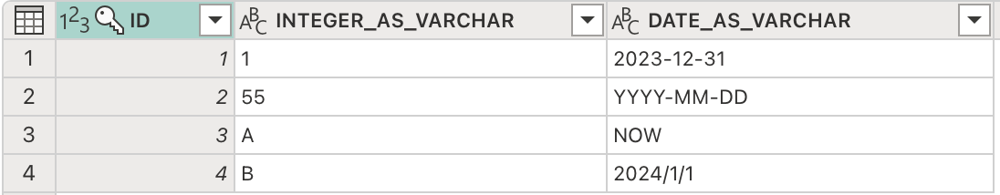
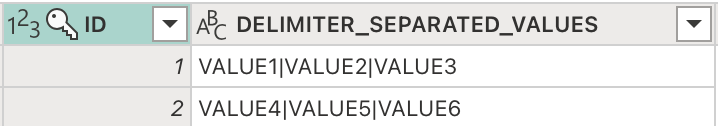
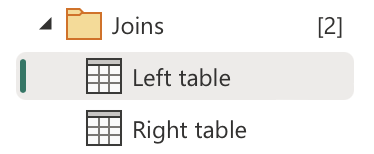
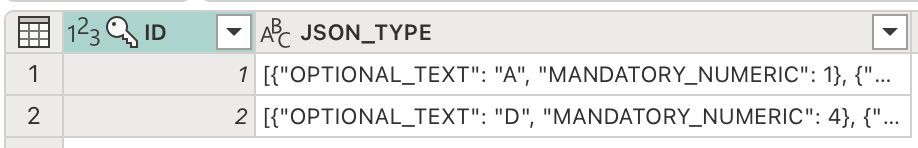
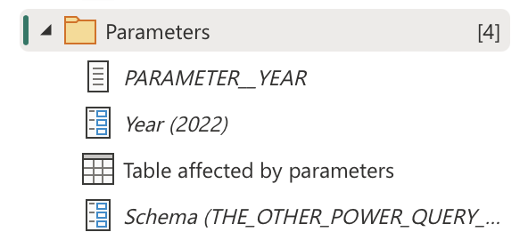
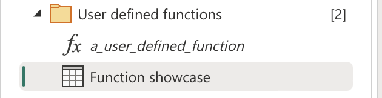

# Introduction to the Power BI platform

A hands on session to get acustomed with Power BI componentry and their interaction.

 
 
 

 
 

---

## What?

Power BI is a platform that facilitates end to end data works:
 - Extraction
 - Transformation
 - Storage - but with a very limited capability
 - Visualization
 - _"Packaging"_

 ---

## Where?

The most common version of Power BI is the cloud one, known as the `Power BI Service`. For clients that prefer on premise techology, there's [`Power BI Report Server`](https://learn.microsoft.com/en-us/power-bi/report-server/get-started), this however is found rarely in the wild and because of that it will not be covered in this training.

 ---

## Why?

It's the BI tool that seems to offer the best bang for the buck:
- Complete data operations toolkit
- Mature APIs for customized interactions
- Constantly updated on a monthly basis

---

## Licensing

The most important difference is around Pro versus Premium features. Whenever we'll refer to something as being available only for Premium we'll do so by adding a   or .

---

## Platform componentry

The Power BI platform consists of multiple components that cover specific functionalities. Some of the functionalities are shared in between components and that might confuse, but I asure it will all make sense.

We will not go into the more recent componentry (Goals, Streaming Dataflows, Scorecards etc.) since they are derived from more _"mature"_ and popular components, which this training will cover in the next slides.

---

###  Dataflows
- Developed only in the `Power BI Service`
- Uses a module called `Power Query` meant to extract and transform data
- Accessible, yet customizable, through its syntax called `M`
- Offers a crude data storage solution

---


### How does `M` syntax look?

```
let
  Source = PostgreSQL.Database("aws-0-eu-central-1.pooler.supabase.com", "postgres"),
  #"Navigation 1" = Source{[Schema = "POWER_QUERY_EXERCISES", Item = "EXERCISE_TABLE__SCHEMA_CHANGES"]}[Data],
  #"Unpivoted other columns" = Table.UnpivotOtherColumns(#"Navigation 1", {"ID"}, "Attribute", "Value")
in
  #"Unpivoted other columns"

```

We'll go in depth about this syntax in the Dataflows section.

---

###  Semantic models
- Development must start locally, using `Power BI Desktop`, but may be continued in the `Power BI Service`
- They use the same `PowerQuery` module used within *Dataflows* to extract, transform and load data
- A fully fledged `OLAP database` receives the data and can be further transformed using a syntax called `DAX` (among others)
- Used to be officially called `Datasets` and might still be refered to as such, some folk may also call it a `Cube`

---

### How does `DAX` syntax look?

```

Yearly Avg =
AVERAGEX (
  VALUES ( 'Date'[Calendar Year] ),
  CALCULATE (
    SUMX ( Sales, Sales[Quantity] * Sales[Net Price] )
  )
)

```
Similar to Excel formulae, since it was made accessible via Excel some 15 years ago. We'll go deeper into DAX in the Semantic Model section.

---

###  Reports
- Development can be done in both `Power BI Desktop` and `Service`
- Queries and displays data from the `Semantic models` in interactive visuals
- Offers an extensive visual collection
- It may be packed with a `Semantic model` when serialized as a `.pbix`
- It is considered a standalone component in the `Power BI Service`

---

###  Dashboards
- Developed only in the `Power BI Service`
- Allows featuring of visuals from multiple reports
- Less popular, since it acts like a hub which facilitates navigation to other reports
- More potent when it comes to streaming data

---

###  Workspaces
- Managed only in the `Power BI Service`
- Groups Power BI content and allows most importantly, access management


---

###  Apps
- Developed only in the `Power BI Service`
- Packages reports and dashboards in a single component, facilitating navigation
- One per workspace

---
The next sections we'll blend theory with exercises. We'll start with the Dataflow.

This is a component some of you might be familiar with since it is present within PowerApps as well.

---
####  Dataflows

Dataflows are making data available for the rest of the platform. They reside within workspaces, but can be accessed from outside their hosting workspace.

The output of a dataflow is one or more tables which are guaranteed to respect a format as described within their query.

Each table is expressed as a M query inside the Dataflow, this covering both the data extraction and transformation part.

---

####  Dataflows

The same PowerQuery engine is also used by the semantic models when extracting a loading data in their tabular database, hence a lot of the knowledge will carry over.

Dataflows are primarily an accessibility tool, in the sense that they make data available in a single point in an agreed upon format.

The data present can get refreshed programatically, or on a schedule from the setting screen with a frequency of either 8 or 48 times per day.

---
####  Dataflows

Data sources are automatically mapped, based on the queries (or tables) featured, and they require some credential management.

Each dataflow is managed and developed by an Owner.

What's upstream of a dataflow:
- Can be consumed by Semantic Models. 
-   Dataflows can also be based of other dataflows.

---
####  Dataflows
##### **Exercises**: Data type casting

Consider the structure below (also accessible under `Data types/Type casting`):



---
####  Dataflows
##### **Exercises**: Data type casting

- What are some issue that you can identify in the query result above?
- How would you address them?
---
####  Dataflows
##### **Exercises**: Transformation

- Open the query under `Data transformation/Delimiter separated values`:


- Let's debate about increasing row count versus increasing column count.
- Let's showcase some more basic tranformations.

---
####  Dataflows
##### **Exercises**: Joins

- Cycle through the queries under `Joins/`:



- Let's discuss on when to avoid and when to use merges.

---
####  Dataflows
##### **Exercises**: Semistructured data

- Moving to `Non scalar data types/Non scalar power query types`:



- `Records`, `Lists` and `Tables`

---
####  Dataflows
##### **Exercises**: Parameters

- Check everything under `Parameters/`:

- When to use them and impact on the data source seen in PowerQuery.

---
####  Dataflows
##### **Exercises**: Functions

- Check everything under `User defined functions/`:



---
###  Semantic models

The component you'll probably spend the most time with:
- Extracts, transforms and loads data with a Power Query module of its own (third time it's been mentioned...)
- Models data allowing for a wider variety than Power Query of transformation and behaviours
- Offers data access control both at a row and object level
- Enables data analysis through DAX

---
###  Semantic models

